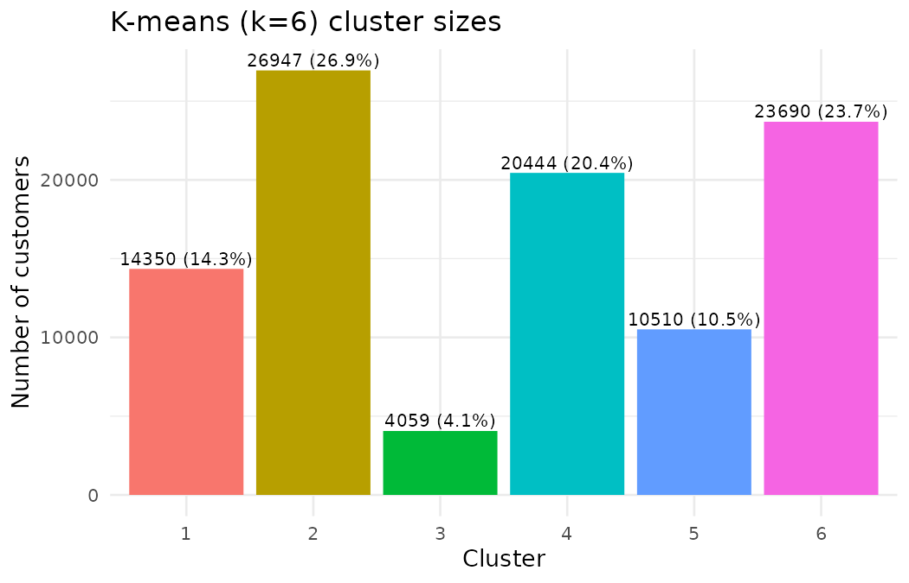
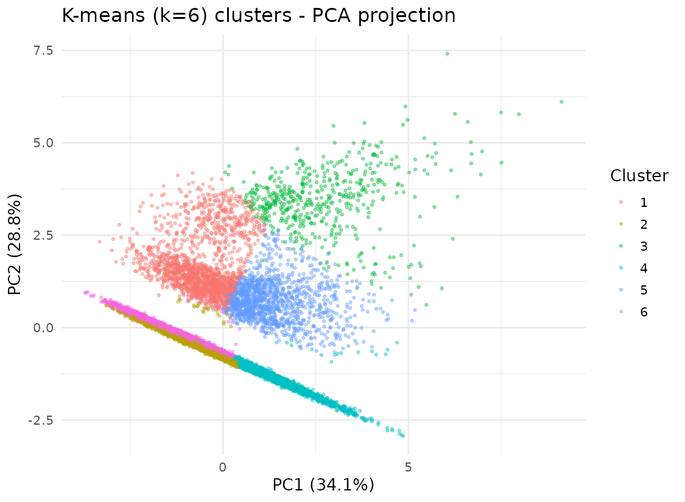
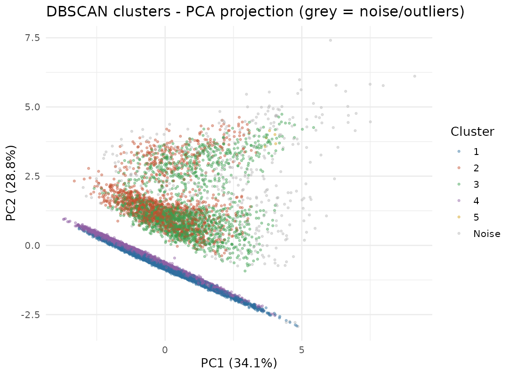
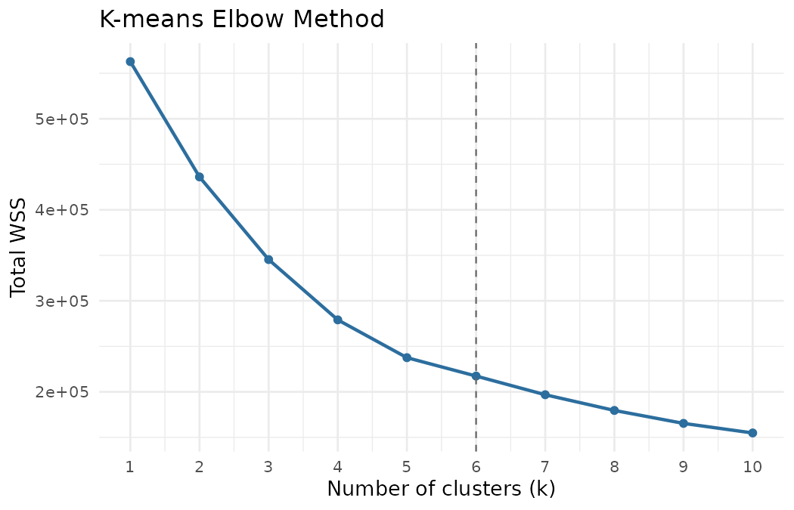
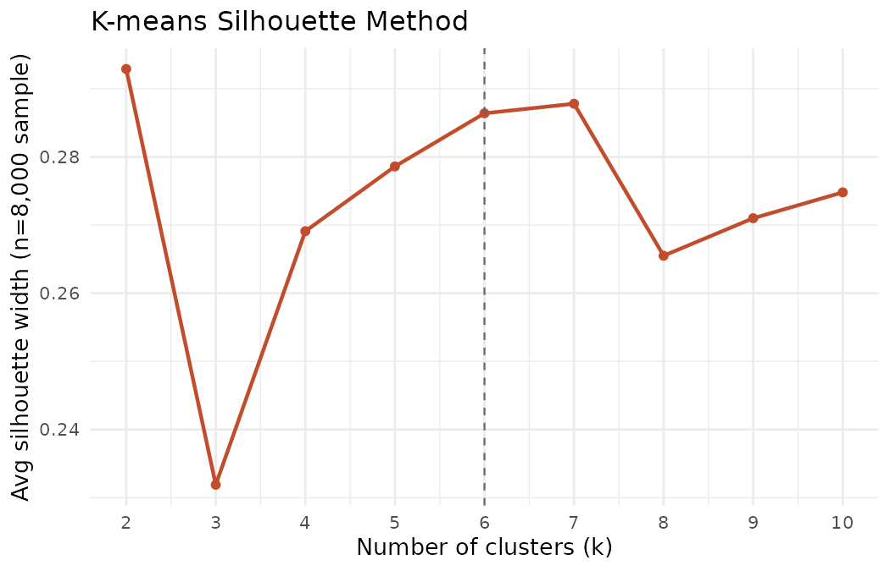

# Customer Risk Segmentation via Cluster Analysis

Unsupervised segmentation of retail banking customers into risk profiles, using K-means for the primary segmentation and DBSCAN as a complementary density-based pass to surface high-risk outliers that a centroid-based method would otherwise average away.

Built as an end-to-end data science exercise: synthetic data generation → data cleaning → preprocessing → clustering → business interpretation, all in R.

## The question

*Can customers be grouped into distinct, actionable risk profiles based on their income, savings, debt, and repayment behaviour — in a way that supports differentiated credit risk management and collections strategy?*

## Data

Since this uses a synthetic dataset (no real banking data involved, for obvious reasons), `src/01_generate_data.R` generates ~100,000 realistic customer records: demographics, product holdings, balances, transactions, credit risk indicators, and engagement metrics — with intentionally embedded data-quality issues (missing values, entry errors, duplicate rows) so the cleaning step has real problems to solve rather than working on data that's already tidy.

## Approach

**Variable selection.** Nine variables were chosen to represent three complementary dimensions of risk, rather than relying on any single number:

| Dimension | Variables |
|---|---|
| Repayment capacity | `monthly_income`, `savings_balance`, `current_balance` |
| Leverage | `total_outstanding_debt`, `debt_to_income_ratio`, `num_active_loans` |
| Repayment behaviour | `credit_score`, `num_missed_payments`, `overdraft_usage_yearly` |

Demographic fields were deliberately excluded — they aren't direct risk indicators and their use in risk scoring raises fairness concerns. The eventual default-flag target was also excluded, to keep this a genuinely unsupervised exercise rather than leaking a label into it.

**Data cleaning.** Three real issues turned up on inspection: ~300 exact duplicate rows, a handful of impossible values (negative income, negative debt-to-income ratios, a savings balance inflated ~1000x by an entry error), and missing values in income (6%) and credit score (4%). Each was fixed with a specific, justified remedy (deduplication, `abs()` correction, winsorizing, median imputation with missingness flags) rather than a blanket approach — details and reasoning are inline as comments in `src/02_clean_and_preprocess.R`.

**Preprocessing.** Skewness and spread were checked per variable rather than assumed:
- Monetary variables were heavily right-skewed (skew up to 25.6) → `log1p` transform, then Z-scored.
- `credit_score` had a healthy, symmetric spread → robust (median/IQR) scaling.
- Three count variables turned out to be zero-inflated enough that their median *and* IQR were both 0 (≥75% of customers have zero missed payments or overdraft use) — which makes robust scaling degenerate. Min-Max normalisation was used instead, since it doesn't depend on a spread statistic.

**Clustering.** K-means was tuned via the elbow method and silhouette analysis across k = 1–10. The two diagnostics didn't fully agree — silhouette's global maximum was at k=2, but that split turned out to be a near-useless "low debt vs. high debt" binary. k=6 sat at a local silhouette peak almost as high, matched where the elbow's marginal gains flattened out, *and* produced six segments that were actually interpretable and business-relevant — including a distinct, small, high-risk cluster. That's the value of checking statistical diagnostics against what the clusters actually mean before picking a final k.

DBSCAN was run as a second, complementary pass — not to replace K-means, but because K-means' centroid-based design forces every customer into some cluster, even the ones who don't really fit the pattern of any of them. DBSCAN doesn't have that constraint: it isolates sparse, low-density points as explicit noise.

## What it found

**K-means (k=6):**

| Segment | Size | Profile |
|---|---|---|
| High-income savers, no debt | 26.9% | Best credit score (707), zero debt — lowest risk |
| Affluent transactors, no debt | 23.7% | Similar, but active current-account users |
| Underbanked, low-income | 20.4% | Lowest income & savings, no debt, but weakest credit (648) |
| Affluent leveraged (mortgage-holders) | 14.3% | High income + meaningful debt, good credit |
| Overdraft-reliant | 10.5% | Weak credit, by far the highest overdraft usage |
| **Financially distressed** | **4.1%** | **Extreme debt-to-income ratio (11.57), highest missed-payment rate — the clear high-risk group** |




**DBSCAN:** flagged 3.3% of customers (3,303) as density-based outliers. That group had a debt-to-income ratio 32x higher, 8x more outstanding debt, and 20x more missed payments than everyone else — a sharper concentration of risk than even K-means' own worst cluster, because DBSCAN isolates points that are sparse across the *whole* 9-dimensional space rather than merely far from one centroid.



The practical takeaway: K-means gives you six broad segments to build a marketing/relationship strategy around; DBSCAN gives you a much smaller, sharper list of individual customers who need manual underwriting attention right now. They answer different questions, and the project uses both rather than picking one.

### Choosing k

Elbow and silhouette were checked against each other before finalising k=6 — see the README section above and `src/03_cluster_analysis.R` for the full reasoning.




## Repo structure

```
.
├── src/
│   ├── 01_generate_data.R          # synthetic dataset generation
│   ├── 02_clean_and_preprocess.R   # cleaning, transforms, scaling
│   └── 03_cluster_analysis.R       # elbow/silhouette, K-means, DBSCAN, figures
├── outputs/
│   ├── figures/                    # elbow/silhouette plots, PCA cluster plots
│   └── data/                       # cluster profiles, assignments, diagnostic tables
├── docs/
│   └── report.pdf                  # full write-up (methodology, limitations, recommendations)
└── data/                           # generated at runtime, not committed (see .gitignore)
```

## Reproducing this

```bash
git clone <this-repo>
cd customer-risk-segmentation
Rscript src/01_generate_data.R
Rscript src/02_clean_and_preprocess.R
Rscript src/03_cluster_analysis.R
```

Requires R with `dplyr`, `lubridate`, `ggplot2`, `cluster`, `dbscan`. Runs in a few minutes on 100,000 rows — no external data downloads, no API keys.

## Limitations

- It's synthetic data — relationships between variables were generated by parametric formulas, not observed behaviour, so the cluster structure is a demonstration of method rather than a claim about real customers.
- `debt_to_income_ratio` and `total_outstanding_debt` keep some residual skew even after log-transforming, because of a structural point mass at zero (customers with no debt at all) that a single continuous transform can't fully smooth out — a proper two-part/zero-inflated model would handle this better.
- Silhouette scores were computed on an 8,000-row sample (it's O(n²), infeasible at 100,000 rows) — cluster assignments themselves still come from the full-data fit, but the reported silhouette values carry some sampling noise.
- DBSCAN's `eps` and `minPts` came from a k-distance elbow heuristic and a standard rule of thumb, not an exhaustive grid search — different values would shift the noise fraction.
- This is a single snapshot in time. A customer's risk trajectory (moving from one segment toward a riskier one over several months) would be far more useful for early warning than a static label, and isn't captured here.

## Tech stack

R · dplyr · ggplot2 · cluster · dbscan · pdflatex (for the full report)

## License

MIT — see [LICENSE](LICENSE).
